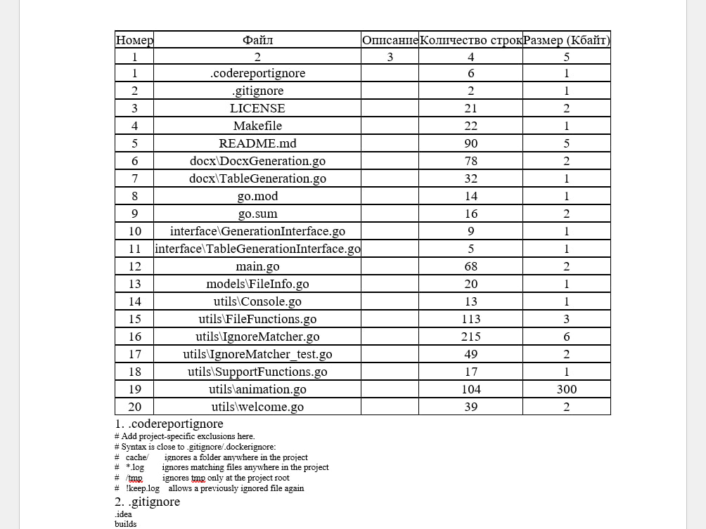

# CodeReport

**CodeReport** — это инструмент для автоматического анализа исходного кода и генерации подробных отчётов. Предназначен для студентов и разработчиков, работающих с проектами на различных языках программирования.

Инструмент сканирует проект, анализирует файлы и создаёт полный отчёт в формате DOCX с таблицами, статистикой и структурой проекта.



## Структура проекта:
```text
│   go.mod
│   go.sum
│   main.go
│   result.png
|
├───docx
│       DocxGeneration.go
│       TableGeneration.go
│
├───interface
│       GenerationInterface.go
│       TableGenerationInterface.go
│
├───models
│       FileInfo.go
│
└───utils
        FileFunctions.go
        SupportFunctions.go
        welcome.go
        IgnoreMatcher.go
```

## Работа с файлом .codereportignore

Создайте файл `.codereportignore` в корне анализируемого проекта для исключения ненужных файлов и папок из отчёта. Синтаксис аналогичен `.gitignore`.

### Примеры использования:

```gitignore
# Комментарии начинаются с #
# Исключить папку с кэшем
cache/
temp/

# Исключить все файлы с расширением .log
*.log

# Исключить файл только в корне проекта
/secret.key

# Исключить все файлы .tmp только в папках
*.tmp

# Вернуть в анализ файл, даже если он исключен правилом выше
!important.log
```

### Правила синтаксиса:

| Паттерн | Описание | Пример | Результат |
|---------|---------|---------|-----------|
| `folder/` | Исключить **только папку** (не файл с таким именем) | `node_modules/` | Папка `node_modules` исключена |
| `*.ext` | Исключить все файлы с расширением | `*.pyc` | Файлы `script.pyc`, `module.pyc` исключены |
| `/path` | Якорь: исключить **только в корне** проекта | `/build` | Папка `build` в корне, но `src/build` остаётся |
| `!pattern` | Отрицание: **вернуть в анализ** файл, исключённый другим правилом | `!important.log` | Файл `important.log` останется в отчёте |
| `path/*/file` | Использовать подстановочные символы | `src/*/main.go` | Все `main.go` на любом уровне под `src/` |
| `**` | Рекурсивный поиск в любых подпапках | `**/temp` | Любые папки `temp` на любом уровне |

### Встроенные исключения

CodeReport **автоматически исключает** следующие типы файлов и папок, даже если `.codereportignore` не создан:

| Категория | Исключаемые файлы/папки |
|-----------|------------------------|
| **Системные папки** | `.git/`, `.idea/`, `.vscode/`, `.DS_Store` |
| **Кэш и временные** | `__pycache__/`, `.pytest_cache/`, `.mypy_cache/`, `.ruff_cache/`, `.tox/`, `.cache/`, `.next/`, `.nuxt/`, `htmlcov/` |
| **Виртуальные окружения** | `.venv/`, `venv/`, `env/` |
| **Зависимости** | `node_modules/`, `vendor/` |
| **Файлы сборки** | `dist/`, `build/`, `target/`, `out/`, `bin/`, `obj/` |
| **Скомпилированные файлы** | `*.pyc`, `*.pyo`, `*.pyd`, `*.exe`, `*.dll`, `*.so`, `*.dylib`, `*.class`, `*.jar`, `*.war`, `*.ear` |
| **Архивы** | `*.zip`, `*.tar`, `*.gz`, `*.rar`, `*.7z` |
| **Медиафайлы** | `*.png`, `*.jpg`, `*.jpeg`, `*.gif`, `*.svg`, `*.webp`, `*.ico`, `*.mp3`, `*.mp4`, `*.webm` |
| **Документы и таблицы** | `*.doc`, `*.docx`, `*.xlsx`, `*.pptx`, `*.pdf` |
| **Файлы конфигурации и блокировки** | `package-lock.json`, `yarn.lock`, `pnpm-lock.yaml`, `composer.lock`, `poetry.lock`, `Pipfile.lock`, `.env` |
| **Базы данных и логи** | `*.sqlite`, `*.sqlite3`, `*.db`, `*.log` |
| **Минифицированные и map-файлы** | `*.min.js`, `*.min.css`, `*.map` |
| **Шрифты** | `*.ttf`, `*.woff`, `*.woff2`, `*.eot`, `*.otf` |


